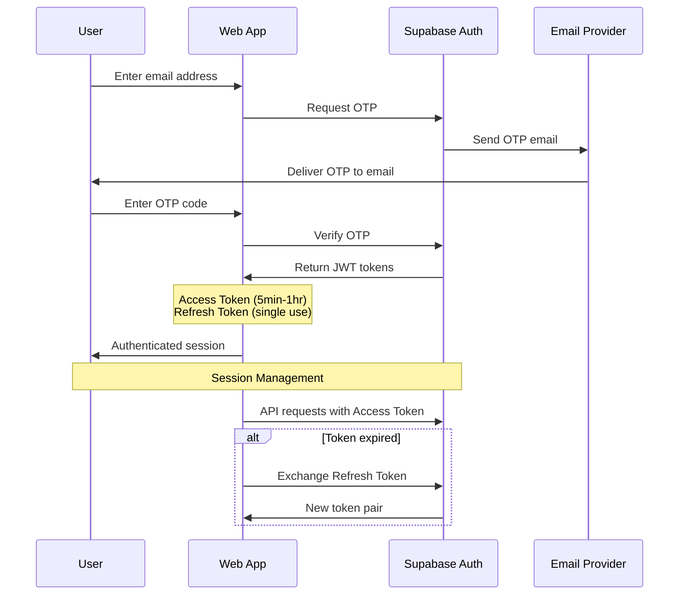

Client authentication has the following high level attributes:

- **Method:** One-time Password (OTP)
- **Delivery:** Email
- **Delivery Provider:** [Resend](https://resend.com/docs/send-with-supabase-smtp)

## Authentication Flow

### Session Based Authentication

A session is created when a user signs in. By default, it lasts indefinitely and a user can have an unlimited number of active sessions on multiple devices.

A session is represented by an access token in the form of a JWT, and a refresh token which is a unique string.

Access tokens are designed to be short lived, usually between 5 minutes and 1 hour while refresh tokens never expire but can only be used once. You can exchange a refresh token only once to get a new access and refresh token pair.

A session terminates, depending on configuration, when:

- The user clicks sign out.
- The user changes their password or performs a security sensitive action.
- It times out due to inactivity.
- It reaches its maximum lifetime.
- A user signs in on another device.

[More Details](https://supabase.com/docs/guides/auth/sessions)
