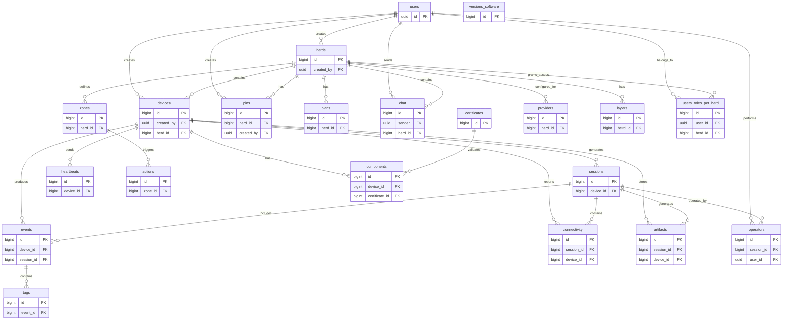

# Database Schema Overview

The Scout database consists of interconnected tables that manage devices, events, users, and spatial data. The diagram below shows the table relationships.

## Key Relationships

- **Users** create and manage **Herds**, **Devices**, and **Pins**
- **Herds** contain multiple **Devices** and define access permissions
- **Devices** generate **Sessions**, **Events**, and **Connectivity** data
- **Events** can contain **Tags** for object detection results
- **Zones** trigger automated **Actions** for spatial monitoring
- **Components** are validated by **Certificates** for device compliance
